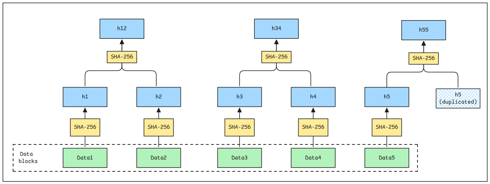

A Merkle Tree is a data structure used primarily in computer science and cryptography to efficiently and securely verify the integrity and consistency of large datasets. It is a binary tree where the leaves store cryptographic hashes of data blocks, and each non-leaf node contains a hash of its child nodes.

1. Concepts of a Merkle Tree
Hashing:

i) A Merkle Tree relies on cryptographic hash functions (e.g., SHA-256) to create fixed-length outputs (hashes)  from input data.
i))Hashes are unique to the input data, so even a small change in the data results in a completely different hash.

2. Leaf Nodes:

The bottom level of the tree consists of leaf nodes, each containing a hash of a data block (e.g., a transaction in a blockchain or a file chunk).
Example: If you have four data blocks (D1, D2, D3, D4), their hashes (H1 = hash(D1), H2 = hash(D2), etc.) form the leaf nodes.
3. Non-Leaf Nodes:

Each parent node is created by hashing the concatenated hashes of its child nodes.
Example: For leaf nodes with hashes H1 and H2, the parent node’s hash is H12 = hash(H1 + H2).
4. Root Node (Merkle Root):

The topmost node of the tree, known as the Merkle Root, is a single hash that represents all the data in the tree.
The Merkle Root is a compact way to summarize the entire dataset.
5. Binary Structure:

Merkle Trees are typically binary, meaning each parent node has exactly two children (though variations exist).
If the number of data blocks is odd, the last hash may be duplicated to maintain the binary structure.
How a Merkle Tree Works
To construct a Merkle Tree, we need to follow these steps:

1. Divide the dataset into smaller blocks (e.g., transactions or file chunks).

2. Compute the hash of each block to create leaf nodes.

3. Pair the hashes and compute the hash of each pair to form the next level of the tree.

4. Repeat until a single hash (Merkle Root) remains.

Example:

Data Blocks: D1, D2, D3, D4
Leaf Hashes: H1 = hash(D1), H2 = hash(D2), H3 = hash(D3), H4 = hash(D4)
Parent Hashes: H12 = hash(H1 + H2), H34 = hash(H3 + H4)
Merkle Root: HR = hash(H12 + H34)
Merkle Tree Construction Algorithm
The algorithm constructs a Merkle Tree from a list of data blocks (e.g., transactions or file chunks) using a cryptographic hash function (e.g., SHA-256). Here’s how it works:

Steps
Prepare Data Blocks

Start with a list of data blocks (e.g., transactions, file chunks, or any data segments). Ensure the data blocks are in a consistent format for hashing.

Hash the Data Blocks

Compute the cryptographic hash (e.g., SHA-256) of each data block to create the leaf nodes of the tree. Store these hashes in a list.

Handle Odd Number of Hashes

If the number of leaf hashes is odd, duplicate the last hash to ensure an even number of nodes for pairing.

Build the Tree Bottom-Up

Pair the leaf hashes and compute the hash of each pair to form the parent nodes. If there’s only one hash left at any level, it becomes the parent node (or is duplicated if needed). Repeat this process, creating higher levels of the tree by hashing pairs of nodes, until a single hash remains: the Merkle Root.

Output the Merkle Root

The Merkle Root is a single hash that summarizes all the data blocks. Optionally, store the entire tree (or parts of it) for verification purposes.

Explanation of the Algorithm
Input

A list of data blocks (e.g., [D1, D2, D3, D4]). A cryptographic hash function (e.g., SHA-256).

Leaf Node Creation

For each data block Di, compute Hi = SHA256(Di). Example: For blocks [D1, D2, D3, D4], compute [H1, H2, H3, H4].

Pairing and Hashing

Pair consecutive hashes: (H1, H2) and (H3, H4). Compute parent hashes: H12 = SHA256(H1 + H2) and H34 = SHA256(H3 + H4). If the number of hashes is odd, duplicate the last hash: e.g., for [H1, H2, H3], pair (H1, H2) and (H3, H3).

Iterate Up the Tree

Use the parent hashes [H12, H34] as the next level. Pair and hash again: HR = SHA256(H12 + H34). Continue until only one hash (the Merkle Root) remains.

Edge Cases

Empty Input: Return null or an error.
Single Block: The Merkle Root is simply the hash of that block.
Odd Number of Hashes: Duplicate the last hash to maintain the binary structure.
Output

The Merkle Root, a single hash representing all data blocks. Optionally, retain the tree structure (hashes at each level) for verification or proof generation.